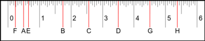

# ruler.pl6

Generate an svg ruler with perl6. The ruler can be metric, 'Merican, or some made up form of measurement.

Usage: ./ruler.p6
`./ruler.p6 > image.svg && convert image.svg -resize 500x100 image.png`

Which makes:

